# Beauty Broker.

### An online beauty retailer for skincare lovers!

## Contents
- [About](#about)
- [Web Marketing](#web-marketing-and-search-engine-optimisation)
- [User Experience](#user-experience)
    - [Target audiences](#target-audiences)
    - [User Stories](#user-stories)
    - [Beauty Broker's Aims](#beauty-brokers-aims)
    - [Iterations](#iterations)
    - [First Time Visitors](#first-time-visitors)
    - [Returning Visitors](#returning-visitors)
    - [User Journey](#user-journey)
    - [Colour Scheme and Fonts](#colour-scheme-and-fonts)
    - [Wireframes](#wireframes)
- [Features](#features)
- [Technologies Used](#technologies-used)
- [Testing](#testing)
- [Deployment](#deployment)
- [Credits](#credits)

## About

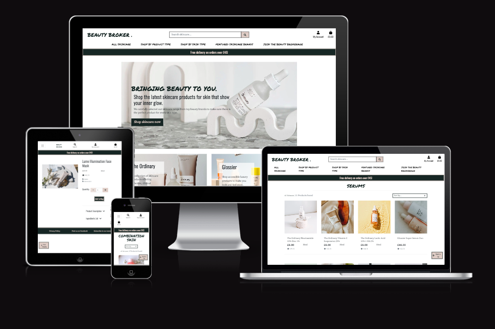

Beauty Broker is a website for a fictional online skincare retailer, aimed at those with a love for skincare. The code was written in Gitpod, with the repository stored in GitHub and hosted on Heroku with an Elephant SQL PostGreSQL database.

This site was born out of my own love and interest in skincare having battled through acne and hyperpigmentation. The knowledge I have gained through research and watching some of my favourite 'Skinfluencers' (featured in the Skincare Secrets page) has really improved not only the condition of my skin but also my self-confidence. Beauty Broker aims to provide shoppers with not only a range of highly rated skincare products to purchase, but also equip them with the knowledge of how to use these products to transform their skin and their own self-confidence.

Potentail customers can easily navigate to find the product they are looking for by shopping by product type or skin type as well as sorting by price/category/rating. The website also aims to empower it's users by providing information they might find useful when shopping for skincare such as what ingredients to look for, suggesting products for their skin type and providing them with a suggested basic skincare routine.

The site provides full e-commerce purchasing functionality to support both shoppers and store owners in tracking orders through the use of accounts and webhooks.

Store owners can also use the site to control their product tool, allowing them to provide shoppers with the latest in skincare trends and keep up with new product releases. They can also edit and remove existing lines.

The Beauty Broker website was made with the Django framework and largely utilises HTML, CSS, Python and components of Javascript/jQuery.

A link to the live site can be found [here](https://beauty-broker.herokuapp.com/).

## Web Marketing and Search Engine Optimisation

Beauty Broker is a 'Business to Customer' site, aimed at selling skincare products to indiviual users. With this in mind, the core business intent of the website is to sell skincare, and to do it in a way that educates shoppers so that they can make informed purchases and buy with confidence. This confidence and positive user experience gained through education will then encourage the user to shop with us again. If a product they have purchased works well for them, they are likely to return repurchase.

Our users are anyone interested in skincare or wanting to see improvements in the health and condition of their skin. A large proportion of our users will be adults and young adults that use Facebook, so this is a great platform for a marketing presence. Other platforms for consideration are Instagram and TikTok - many 'Skinfluencers' have risen to fame through TikTok, so much so it is sometimes referred to as 'SkinTok'!. 

Facebook is a platform that would be great for continuing the education of our users through blog posts, videos and flash sale advertisements. Marketing on Instagram and TikTok would also be great for sale advertising (younger users may be more in need of a sale) along with demonstrating the latest skincare trends.

[Link to Facebook Marketing Page](https://www.facebook.com/people/Beauty-Broker/100090515160784/)

Facebook Business Page

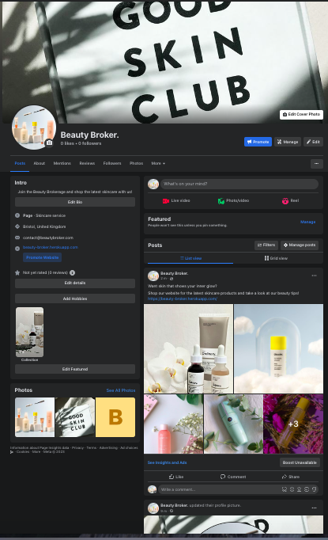

 

Facebook Screenshot 1

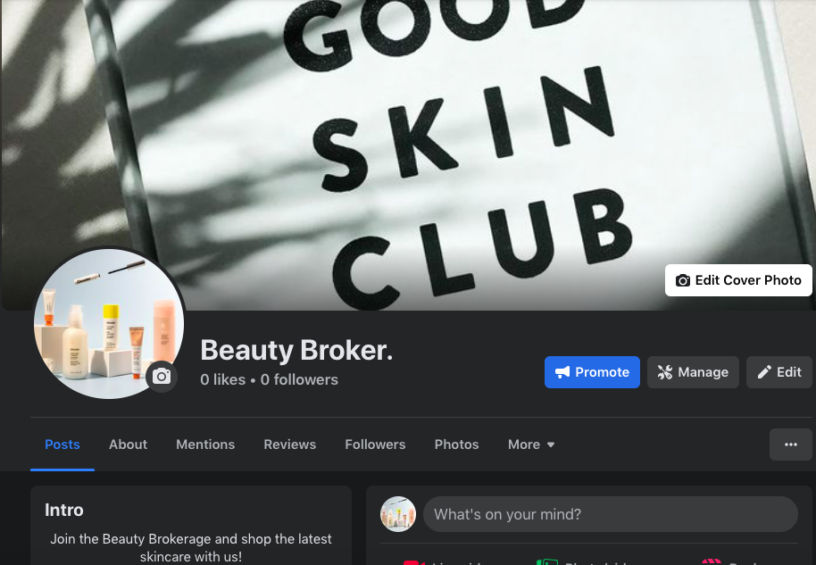

 

Facebook Screenshot 2

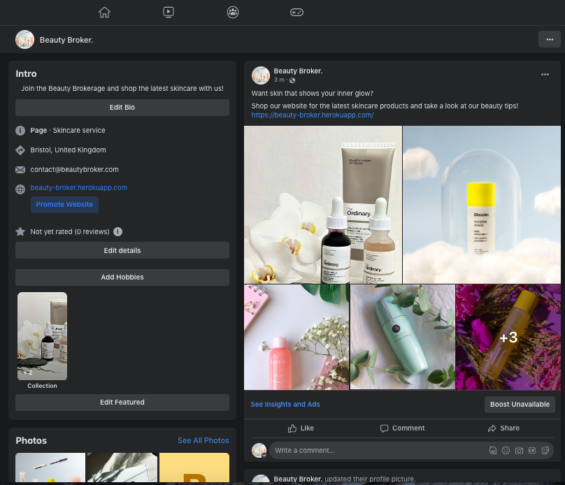

 

Beauty Broker also employs the use of MailChimp to perform email marketing. Users can subscribe the the Beauty Broker emails to receive information about the latest product releases, any sales and to gain access to further skincare advice.

Both social media and email marketing are a great option for Beauty Broker as a smaller online retailer with a small advertisement budget, whilst also providing channels to offer skincare advice and encourage potential buyers to try new products!

I conducted a brainstorm of skincare keywords to help me decide which ones to include in the meta tags and prime real estate (header text, home page).

[SEO Keyword Brainstorm](wireframes/skincare-keywords.pdf)

A further SEO consideration in the Beauty Broker project was the external links listed. These are primarily located in the Skincare Secrets section, and contain links to other high-ranking, high-traffic, reliable websites such as Allure, Cosmopolitan and a dermatology website. Even the Youtube links featured have had thousands of views, with the 'Skinfluencers' having as many as 4.5 million followers.

## User Experience

### Target Audiences

- Primarily aimed at adults and young adults who want to take care of their skin
- For users with an existing knowledge of skincare
- For users with an existing skincare routine looking to add new products
- For users with no knowledge skincare
- For those wanting to target a particular skin concern i.e. blemish prone skin
- For users wanting to purchase new skincare products now
- For users wanting to browse their next skincare purchase
- For users wanting to research skincare
- For users wanting to subscribe to a newsletter

### User Stories

Before beginning to code the Beauty Broker website, I took some time to reflect on what it was that users would expect from a skincare website. I used GitHub's Projects feature to create a User Stories board to list all of the user goals I had come up with, and the epics that the vast majority of these would fall under.

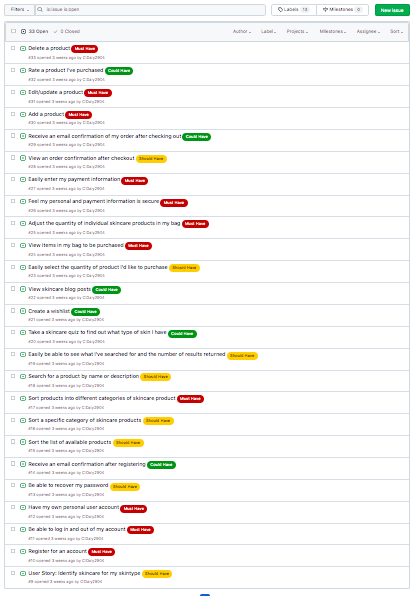
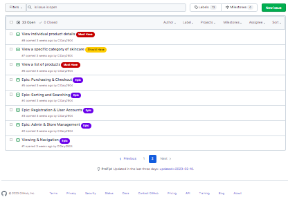

1. Epic - Registration and User Accounts
    - User - create a wishlist
    - User - recieve a confirmation email after registering
    - User - be able to recover my password
    - User - have my own personal account
    - User - be able to log in and out of my account
    - User - register for an account
2. Epic - Viewing and Navigation
    - Navigate easily around the sites pages
    - Be able to see a list of all products
    - Be able to view a specific product details
    - View a specific category
3. Epic - Sorting and Searching
    - User - easily see what I have searched for and the number of results returned
    - User - search for a product by name or description
    - User - sort products into different categories of skincare product
    - User - sort products into different skin types
    - User - sort the list of available products
4. Epic - Purchasing and Checkout
    - User - receive an email confirmation of my order after checking out
    - User - view order confirmation after checkout
    - User - easily enter my payment information
    - User - feel my personal information is secure
    - User - adjust the quantity of products in my bag
    - User - view items in my bag to be purchased
    - User - easily select the products I would like to purchase
5. Epic - Admin and Store Management
    - Store - delete a product
    - Store - edit/update a product
    - Store - add new products

I also considered future implementations outside the scope of this sprint:
- User - Rate a product I've purchased
- User - View skincare blog posts (I eventually decided to implement this in the current sprint so that the site could add more value to users wanting to find out more about skincare products and routines)
- User - take a skincare quiz to find out what type of skin I have

### Beauty Broker's Aims

- To create an aesthetic website to draw the eye of customers
- To create a website that showcases and promotes the range of effective skincare on offer
- To provide a way for users to purchase the skincare products available
- To be able to track orders made through the website
- To be able to manage the range of skincare on offer
- To provide meaningful information for users that allows them to select skincare right for them, encouraging them to shop with us again
- To encourage users to return to the site via email subscriptions
- To present the skincare available in a way easy to navigate to retain user attention
- To provide a site with high user experience to retain users
- To provide a means of web marketing to customers through emails and Facebook page

### Iterations

To take an Agile approach to the project, I planned the stages that I would carry out the work. I categorised each User Story into 'must have', 'Could have' and 'Should have' and almost all of them fell into one of the 5 Epics.

At this stage in the Beauty Broker website, I completed all user stories apart from a couple of the 'could have items', which I decided were outside the scope for this sprint of the project.

However, I did end up completing the user story for viewing blog posts via the implementation of the 'skincare secrets'. When carrying out user testing, I found that some of my family/friends did not know much about skincare products or what they would need to look for. This made the user story for viewing skincare blog posts more important to me, as I wanted users to be able to choose their skincare products with confidence. I also decided this was a good move for the store as an informed user is more likely to make a purchase, and return to the site in the future if they found it helpful!

#### Iteration 1
Iteration 1 was mainly setting up the website and incorporating essential functionalities that were needed to build the rest of the project such as accounts and navigation via the main navbar. I completed the bulk of the Viewing and Navigation epic within this iteration.

Thanks to Django and utlising all-auth, setting up the apps and user accounts was accomplished relatively quickly. This allowed me to add basic product and product detail views within this iteration.

 

Iteration 1

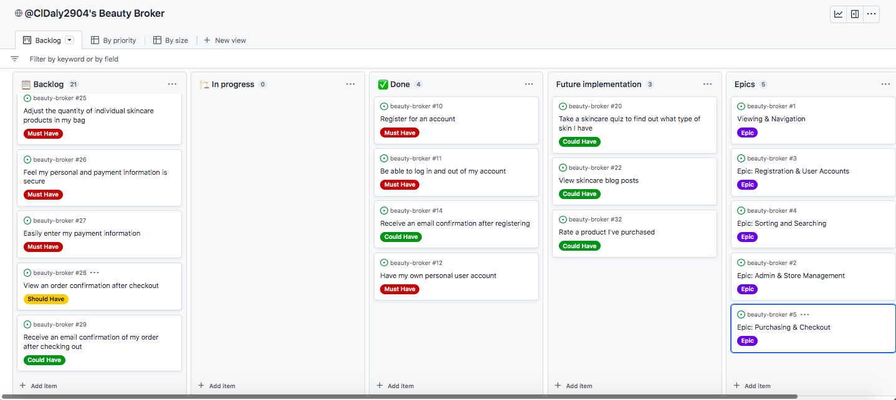

 

#### Iteration 2
Iteration 2 focused on the epic for Searching and Sorting items. It was very time consuming sorting products by skincare, category, skin type and implementing the search functionality, thus consituted a whole iteration!

Iteration 2

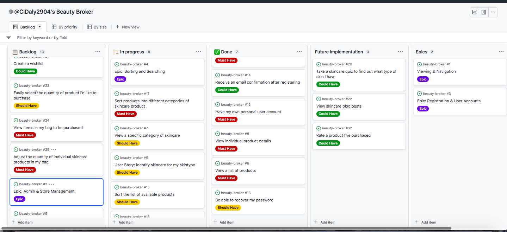

 

#### Iteration 3
Iteration 3 was also a large iteration. It focused on the Purchasing and Checkout epic, including the bag functionality.

Iteration 3

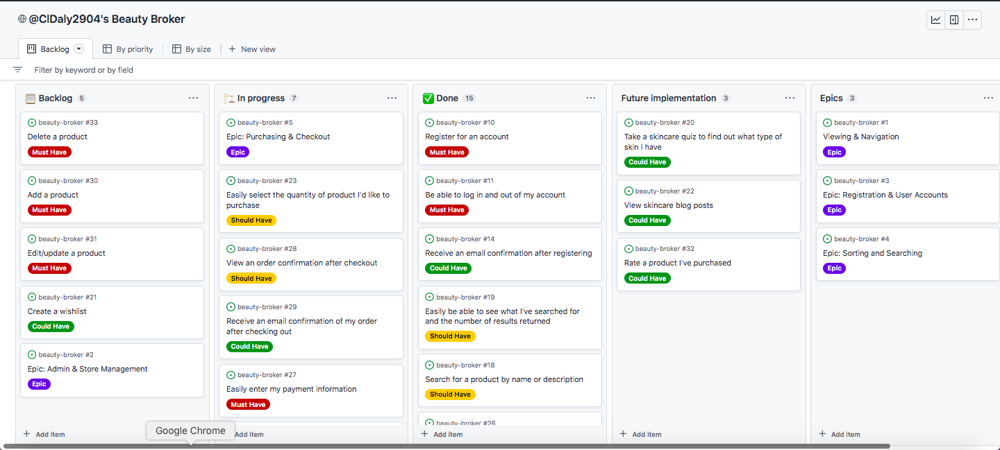

 

#### Iteration 4
Iteration 4 moved away from shopper user stories and brought the focus to the Admin and Store Management epic. In this iteration I implemented the CRUD functionality for store owners to manage the range of skincare products within their store.

Iteration 4

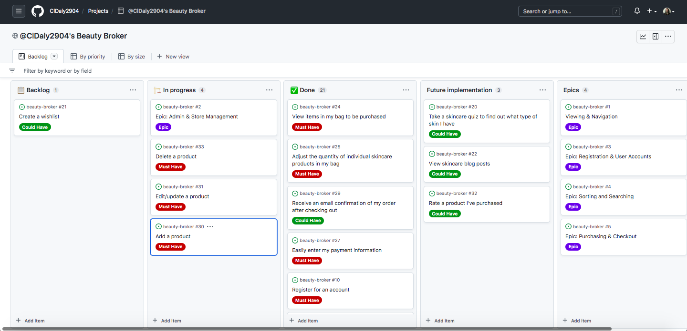

 

#### Iteration 5
After all the 'essential' e-commerce functionalities were completed, I used iteration 5 to introduce extra features to add value to the user.
I added the wishlist functionality, brand focus and skin secrets pages. The features introduced in this implementation of the project help to make the Beauty Broker site more educational for its users and help them to understand the products they're buying, and encourage them to return!

Iteration 5

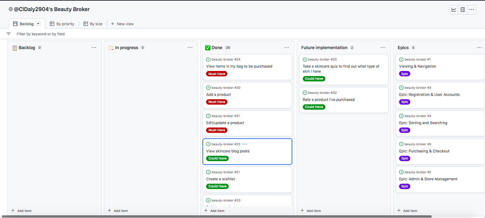

 

### First Time Visitors

- Visitors are greeted by an elegant landing page, where the purpose of the site as a skincare retailer is clear
- The home page shows the key features of the webite - shopping skincare, information on brands, skincare tips and the ability to sign up to a newsletter, with linke to the relative pages
- The navbar is clearly positioned and laid out
- The users have a choice about how they want to shop for their products- by product type, skin type and sorting by price etc
- First time users that are not familiar with skincare are able to access information about basic skincare routines, the different product types
- The Skin Secrets page also directs users to other high quality websites so they can learn more about what products and ingredients they might want
- First time visitors are encouraged to return to the site via web marketing in the form of email subscriptions and a Beauty Broker Facebook page
- Flash messages help instill user confidence in the site
- First time visitors can easily register for an account
- Visitors have the option to purchase without havign to go through the process of making an account if they so choose

### Returning Visitors

- Returning visitors can quickly navigate to their favourite products via searchin, product categorising and sorting
- Returning visitors can log into their account to see their previous orders
- Returning visitors have a faster time going through checkout if they have saved information to their profile
- Returning visitors can view their wishlist to refresh themselves on items they want to purchase

### User Journey

1. As a user, the landing page informs me that I am on the Beauty Broker website and the key words I can see tell me this is a skincare website
2. The homepage shows that I can shop skincare, view featured brands, signup to a newsletter or view more information about skincare products
3. I can see a clear navigation menu at the top of the page, with a search bar. The icons show me that I can create an account, and that I shopping bag tells me that I have an empty shopping bag
4. The options on the navigation menu show me that I can access the products through product category, by skin concern or view all products.
5. I don't know much about skincare so I click to take me to the page that will give me more information on this.
6. After reading the page and selecting the links I think will be useful to me, I have an idea about what type of products I need in my routine and the types of ingredients I want in them.
7. I want something to help with my dry skin so I click the option to show me products for dry skin.
8. When I click on the product I want, a page tells me information about it including ingredients so I can check if it has a specific ingredient I'm after (e.g. hyaluronic acid for dry skin). I can add the selected item with my bag, with the option of amending the quantity if I want. A message at the top tells me I have successfully added my chosen quantity to my shopping bag.
9. I hit the keep shopping button and select a further few items.
10. When I am finished selecting my products, I go into my shopping bag and double check what I am about to buy before going to checkout.
11. Upon arriving on the checkout page, I see that if I create an account then I can save my information for future, so I decide to register.
12. After confirming with via a confirmation email I have an account!
13. I go to fill in the checkout form, which lets me know which fields I MUST fill in and highlights if I make any errors.
14. After entering my information correctly, there is a short loading screen then I am met with a page that confirms my order has been successful!
15. When I go in to my account section, I can see the order I have just created and the delivery information that I asked to save.

Whilst planning the functionality for the Beauty Broker website, I had to consider how I was going to achieve both the aims for the user and the restaurant. This led to the creation of the features found in the Features section.

### Colour Scheme and Fonts

It is a strong belief within the beauty community that skincare is selfcare! With this in mind, I wanted to create a website that felt calming and luxurious for users. I used [Webflow's Top 10 Google Fonts for your webpage](https://webflow.com/blog/google-fonts) to help me choose a font combination that allowed me to create a brand feeling through my fonts that was also easy to read and accessible for users.
I browsed a range of colourschemes from [Jordan Prindle Designs](https://www.jordanprindledesigns.com/blog/color-palettes) and felt that the 'Enchanted Colour Palette' had the desired feel I wanted for the Beauty Broker website.

### Wireframes

Before building my site in Gitpod, I took all of the features I thought to be in scope and combined these with my design ideas to create wireframes in Lucidchart. This helped me to implement a consistent design across the Beauty Broker website to enhance a cohesive feel.

- [Home wireframe](wireframes/home-page.pdf)
- [Product Page](wireframes/product-page.pdf)
- [Product Detail](wireframes/product-detail-page.pdf)
- [Bag wireframe](wireframes/bag-page.pdf)
- [Checkout](wireframes/checkout-page.pdf)
- [Checkout Success wireframe](wireframes/checkout-success.pdf)
- [User Profile wireframe](wireframes/user-profile.pdf)
- [Newsletter](wireframes/newsletter.pdf)
- [Brand Page](wireframes/brand-page.pdf)

### Entity Relationship Diagram
As Python is an object-orientated programming language, I took some time to consider what objects would be involved in an ecommerce store, how they would related to each other, and what attributes those objects would have.

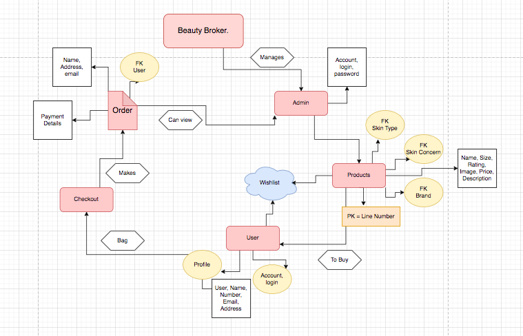

## Features

### Navigation bar
The striking navbar can be found at the top of the Beauty Broker page and is fully responsive, with three designs based on screen size. Originally, the 'Beauty Broker.' logo text was not present on small and medium sized navbars, but during the user testing stage, feedback was that this meant that users weren't really sure what the name of the website was! Therefore I altered the navbar so that it always had the Beauty Broker logo in some format, without compromising on functionality.

The options available on the navigation bar differ depending on if a user is logged in, and which level of user is logged in. A logged out user will only have the drop down 'register' and 'login' under the 'My Account' section. A normal user that is logged in will be able to access the 'log out' page as well as a link to their own 'my account' page to show their order history, saved delivery information and any wishlist items. A store owner or super user has these in addition to the 'Product Management' option under the 'My Account' tab, where they can add a new product.

Full size nav

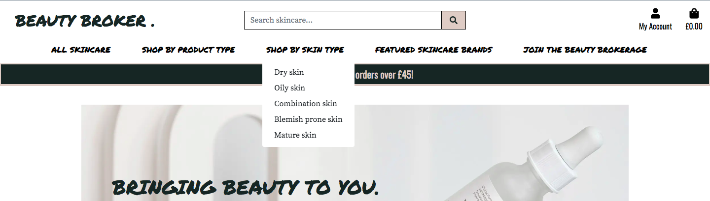

Med screen sizes nav

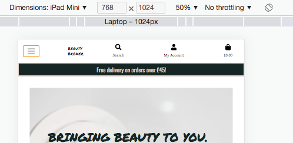

XS screens nav

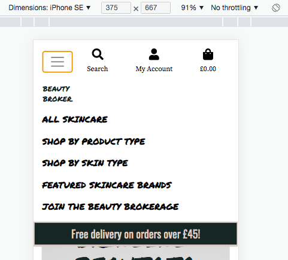

 

### Footer
The footer of the website is simple but contains key information. There is a link that takes users to an external page where they can view the privacy policy, a link to the Facebook page and the newsletter signup page.

Footer

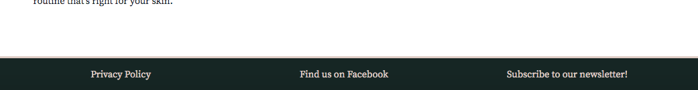

### Home Page
The Beauty Broker homepage contains an overview of the sites different features, to clearly present the purpose of the site to users.

Right at the top of the home page is a link and call to action button that demonstrates the primary purpose of the site is to sell high quality skincare products. Underneath, there are links to the brand sections, newsletter signups and the skincare secrets pages. The homepage gives to give the user a concise look at the different sections of the site they can explore, along with being prime real estate for key words to denote the sites purpose.

Home Page

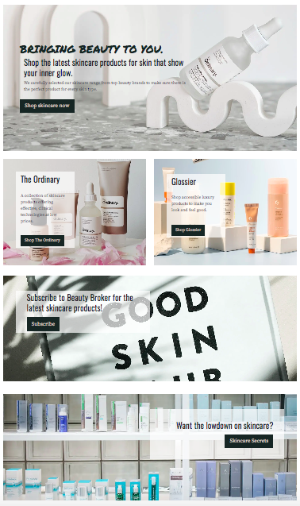

 

### Product Pages, Sorting and Searching
Users can list a page of products that displays key information about products - name, price and, if applicable rating/size. The product image is also displayed to keep the site eye catching for the user and allow them to select products at a glance.

To better aid users in selecting the products right for them, products can be sorted and categorised in several ways. Firstly, the all product option lists all available products on the site, with the option to sort them by price, rating or alphabetically. Further to this, users can choose to shop by either the product category (e.g. moisturisers), or by skin concern category (i.e. oily skin). Sorting is also available within these categories. For example, a user could very easily find the highest rated sunscreen!

This adds value to the user by saving them time if they know what they want, but also offering product selections to users that are unsure what skincare item would be good for their skin.

Products category page

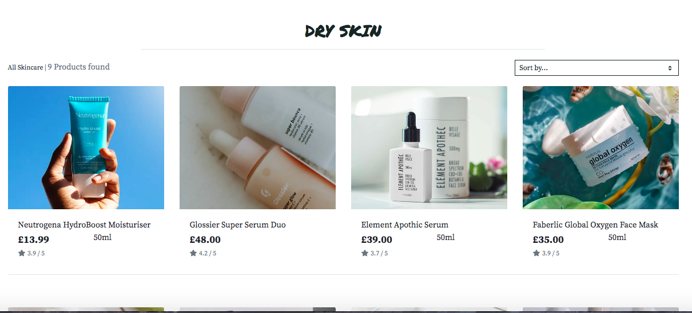

Search a product

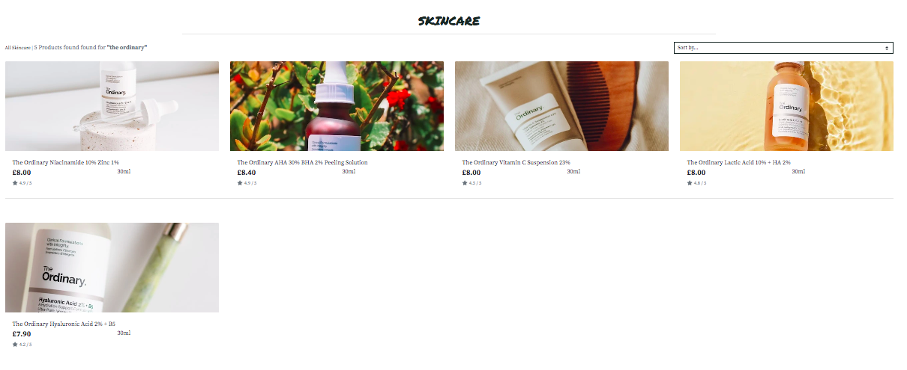

 

### Product Detail Pages
The product detail page contains all information the user would need to make an informed decision about their product purchase. It includes the name, description, price, ingredients and, if applicable, a rating or size.

The ingredients section was a later, but crucial addition to this page. Whilst creating this project, a family member had a bad reaction to the face cream that they were using. They didn't understand what was in it that had caused this reaction (which later transpired to be related an essential oil within the product). This showcased the importance of showing ingredients and inspired me to add a link to the [Paula's Choice Skincare Dictionary](https://www.paulaschoice.com/ingredient-dictionary) in this section to help users be better informed about the ingredients in their skincare.

This page is also where users can add the item to their bag, or their wishlist. If adding to bag, the quantity buttons allow the adjustment of the desired quantity of product to be added to the bag.

Store owners can use this page to edit or delete the selected product. It is important to note that I added a secondary confirmation page before product deletion to help minimise the risk of store owners deleting products accidentally (the edit/delete buttons are not visible if a lower level of user is logged in).

Product Detail Page

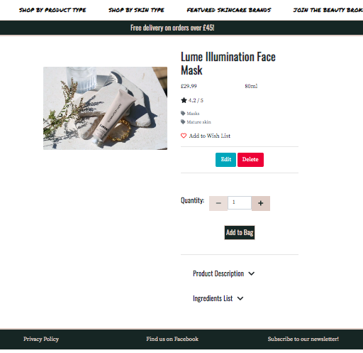

 

### User Registration and Accounts
Accounts are a fundamental part of this e-commerce site. Logging in and registering for an account is made easy through the use of Django all-auth, with minimal stages that the user has to go through. Although a user can make a purchase without creating an account (so as not to deter potential buyers that do not want to go through the process), creating an account present many benefits to the user.

Firstly, logged in users can save delivery information to their account to speed up the checkout process. The 'My Account' section available to authenticated users can hold a record of this information, along with access to their past orders. A summary of past orders is shown, and users can click into these to view the order in more detail (with the page header and toast confirming to them this is a PAST order).

Logging in also gives users the opportunity to create a 'Wishlist'. This is a great addition to a skincare retail site as often skincare lovers need to finish up their products before purchasing new ones, but are always on the hunt for the next product to try! The wishlist functionality lets registered users create a list of products they have their eye on, and encourages them to return to the site to purchase them.

Accounts

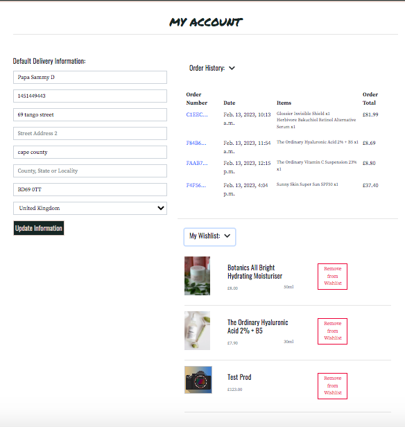

 

### Product Management
If a user is logged in as a store owner/superuser, they have the ability to add, update and delete the products available on their website without having to login to the back end admin panel. These pages can only be accessed by users with the right level of authorisation. The form to add a product can be found under 'My Account', then 'Product Management', whilst editing and deleting a product can be done via the relevant product detail page.

Product Management

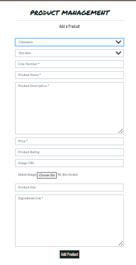

 

### Bag
Prior to going to the checkout, selected items are held in the user's shopping bag. Upon adding to bag, a success toast appears and provides a summary of all the items in the users bag.

Once navigated to, the bag shows the user the details of all the items in their bag and gives them an opportunity to update the quantity or remove the item.

My Bag

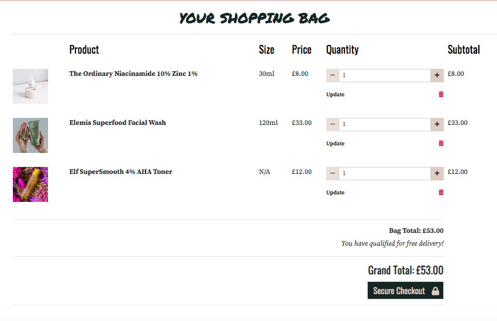

 

### Checkout
The checkout operation is in two stages. Firstly, the user fills in the checkout form with their personal, delivery and payment information. The bag summary is displayed for the user so they can see what they are about to purchase. The validated form shows users which fields are required and gives feedback on any input errors.

There is a short loading screen where the payment is process with Stripe. If the payment is processed correcty, a checkout success page appears with an order confirmation page to confirm to the user their order has been placed, with a summary of all the details. A confirmation email is sent to email in the checkout form, and the order confirmation can be founnd again in the My Account section if the user is authenticated.

In case the browser crashes, webhooks are sent in conjunction with Stripe so that the payment can be tracked and the order still procesed, helping to build consumer confidence.

Checkout Form

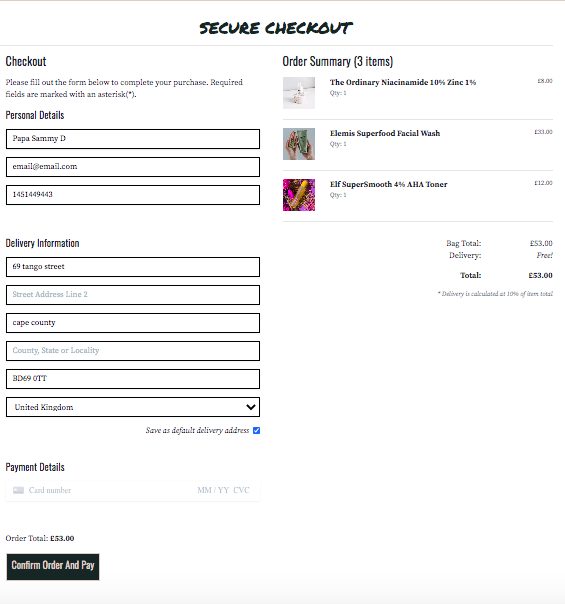

Checkout Success

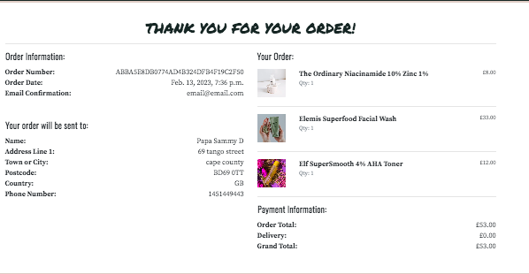

 

### Newsletter
The newsletter page is a form of web marketing. It consists of a simple form generated with MailChimp, where users can subscribe to the Beauty Broker emails for access to the latest skincare products and exclusive offers.

Along with access from the main header, users are encouraged to access this page and sign up with the form from the homepage and a link in the footer.

Newsletter

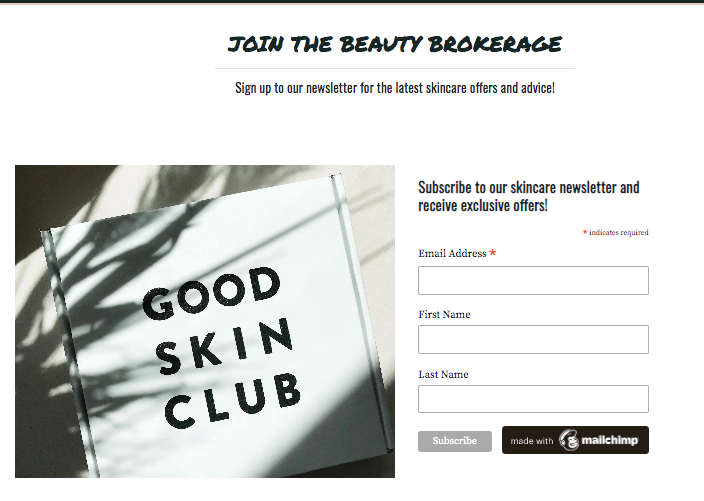

 

### Brand Pages
Beauty Broker highlights two popular skincare brands- The Ordinary (a favourite of the skincare community), and Glossier. These pages serve to highlight the brands and educate users as to what sets them apart in the beauty world. They are both brands that are very popular in the skincare scene at present, so by highlighting these I hope to attract more users to the site.

The pages detail brand information such as their tagline, ethos and link back to products available to purchase on the website, encouraging users to buy!

Brand Pages

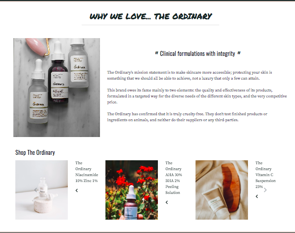

 

### Skincare Secrets
As mentioned earlier, this was originally a feature not meant for this sprint of the website. However, whilst carrying out user testing, I found that many of my guinea pigs (friends and family) were unsure what a lot of the products actually were. It soon became apparent that a user with little understanding of skincare was very unlikely to actually see any reason to make a purchase in the real world.

I created the Beauty Broker website with the aim of making high quality skincare products accessible to not just people that were already interested in skincare, but anyone who wanted help with their skin. I felt that it was necessary to create this page to give users a basic understanding of a beauty routine and provide links to high-quality resources where they could continue their research. The videos chosen to include actually include some of the products available to purchase on the website, so provide another source of marketing/upselling.

This page also helps give credibility to the site and assure users that it is a high quality website, worthy of their trust (and their money)!

Skincare Secrets

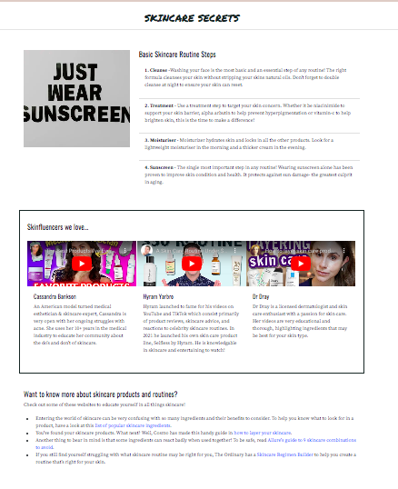

 

### Form Validation

E-commerce websites can pose a big risk when it comes to improperly entered data, for example causing payments to fail. As the website features various forms from login, checkout and product admin, I had to employ the use of both front-end and back-end form validation to try and minimise this risk. I used a mix of Bootstrap form control, Django model fields and form validators/widgets to create forms that rejected invalid data and fedback to the user what was wrong to minimise frustration.

Form Validation (Front)

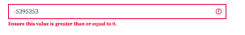

Form Validation (Back)

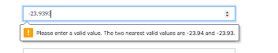

 

### Toasts

To instill user confidence and heighten user experience on the Beauty Broker site, I employed the use of Django's messaging service. Toasts are present across the site for almost every user action to keep the user up to date and confirm their actions have been completed accordingly.

Success Toasts

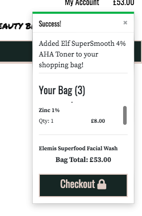

Error Toasts

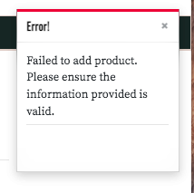

 

## Technologies Used

Eyedropper Tool (Chrome Extension)

 
 - This tool allows me pick any colour from the web page I am and gives me the name (if applicable), hex, hsl and rgb values. I used this to make sure I was using the exact theme colours throughout the site

WebAIM

 
- Contrast Checker - checks the contrast of colours input against the Web Content Accessibility Guidelines. I input my background and foreground/text colours to ensure they meet the WCAG AA/AAA standards
- WAVE - WAVE can identify many accessibility and Web Content Accessibility Guideline (WCAG) errors

Fontawesome

 
- The social media icons on the footer are taken from FontAwesome

Google Fonts

 
- Both my title and body fonts are imported from Google Fonts

W3C Markup Validation Service

 
- I used the HTML validator to run both my html pages and ensure there were no errors
- I used the Jigsaw CSS validator to ensure that my CSS file did not contain any errors

Lighthouse (Chrome DevTools)

 
- An open-source, automated tool for improving the quality of web pages. I used it to audit performance, accessibility, SEO and best practices

GitHub

 
-  To host my repository
- To create user stories
- To take an Agile approach by usign the project board to make iterations

GitPod

 
- An open-source developer platform used to write my code (using VS Code)

Visual Code Studio (VS Code)

 
- Visual Studio Code is a streamlined code editor with support for development operations like debugging, task running, and version control
- I used several VS Code extensions to help make my work more efficient such as:
    - Auto Close Tag (automatically adds HTML/XML closing tags)
    - Auto Open Preview Page (opens a preview panel when markdown or asciidoc file is opened)

Heroku

 
- To host my live site

Bootstrap

 
- Bootstrap CSS framework helped me to create a responsive and visually stunning site without having to spend too much time writing CSS

Django

 
- Django is a Python web framework that encourages rapid development. I used the Django framework, in particular the administration site to help manage my models and objects
- Django allauth is an integrated set of Django applications dealing with account authentication, registration, management that I used for my user accounts

Elephant SQL

 
- PostgreSQL as a service to host my database

Stripe

 
- For processing payments and webhooks

AWS

 
- To store my static files and media

MailChimp

 
- To create a newsletter signup form

LucidChart

 
- To create my entity relationship diagram and brainstorm SEO keywords, and wireframes

Django

 
- Django is a Python web framework that encourages rapid development. I used the Django framework, in particular the administration site to help manage my models and objects
- Django allauth is an integrated set of Django applications dealing with account authentication, registration, management that I used for my user accounts

 

## Testing 
Testing notes for the Beauty Broker project are contained in a separate [TESTING.md](TESTING.md) file.

## Deployment
The live site for Beauty Broker is hosted on Heroku, a platform that enables developers to build, run, and operate applications entirely in the cloud. To deploy the live site on Heroku, I wrote my code in GitPod then pushed the code to GitHub. Heroku uses the code in the GitHub repository to build the live site.

Full details for deploying to Heroku using Git can be found [here](https://devcenter.heroku.com/articles/git).

Heroku Deployment instructions

 
To deploy the live site on Heroku: 
1. Create a Heroku account and log in 
2. Select to create a new app in Heroku. Give it a unique name and create new app 
3. Once the new app is created, we need to set up a few things. 
4. Under the 'Settings' tab, go to 'Add Buildpack button and click to add a buildpack. Select python. This helps Heroku understand it needs to build a Python app. 
5. This project uses Elephant PosgreSQL- Please follow the Elephant SQL Instructions underneath then return to Heroku Deployment 
6. Back in Heroku, on the 'Settings' tab, add in the config-vars such as the SECRET_KEY, AWS_ACCESS_KEY_ID, AWS_SECRET_ACCESS_KEY, DATABASE_URL, EMAIL_HOST_PASS, EMAIL_HOST_USER, STRIPE_PUBLIC_KEY, STRIPE_SECRET_KEY, STRIPE_WH_SECRET, USE_AWS 
7. The settings.py file in Gitpod will need to be updated with the information for the new SECRET_KEY and DATABASE 
8. Set up the html templates by adding a TEMPLATES_DIR variable with 'os.path.join(BASE_DIR, 'templates')'. Under TEMPLATES, update DIRS with the new variable 
9. To make sure the app can be run on the local development server and in Heroku, we need to update the ALLOWED HOSTS key in the settings.py file, it should be updated to include 'localhost' and your Heroku app url (https://'YOUR APP NAME'.herokuapp.com/) 
10. In the base directory on GitPod, create a Procfile and add 'web: gunicorn Your App Name.wsgi`'. This tells Heroku to create/run a web application. 
11. In Heroku, click on the 'Deploy' tab. Select GitHub in the 'Deployment Method' section. You can search for your repository and select it to connect the repo to Heroku. Heroku gives the option to either deploy the latest GitHub code automatically with automatic deploys or to manually deploy a selected branch. 

Elephant PostgreSQL as a service instructions

 
1. Log in or sign up to ElephantSQL. 
2. Press create new instance. 
3. Choose a name and plan. Then click on select region. 
4. Select the data center that is closest to you and press review. 
5. Then just click on "Create Instance". 
6. Go back to the start page and click on your new database. 
7. Copy the URL for the database. 
8. Back in Heroku click on the settings tab of your application. 
9. Click on "Reveal config vars". 
10. Add a new config var named DATABASE_URL and paste in the URL from ElephantSQL as the value. 
11. Go back to Gitpod and install two more requirements for the database: 
pip3 install dj_databse_url 
pip3 install psycopg2-binary 
Update your requirements.txt file by typing in pip3 freeze --local > requirements.txt 
12. Add the DATABASE_URL to your env.py file. 
13. Go to settings.py and import dj_database_url 
14. Comment out the default DATABASES setting 
Add this under the commented out section: 
DATABASES = { 
    'default': dj_database_url.parse(os.environ.get('DATABASE_URL')) 
} 
15. Run migrations for the new database. 

Cloning or forking this repository with GitHub

 
- How to fork the project 
Make sure you are logged in on GitHub and then find the repository you want to fork. 
On the top right click the Fork button to make a copy to your account. 
- How to clone the project: 
Click on the "Code" tab under the repository name that you want to clone. 
Then click on "Code" button to the right above the files listed. 
Click on the clipboard icon to copy the URL. 
Open Git Bash in Gitpod or the IDE of your choice. 
Change the working directory to where you want your cloned directory. 
Type git clone and then paste in the URL that you copied, press enter. 
With the repository cloned, run pip3 install -r requirements.txt to download all the dependencies required for deployment. 
Run the command "python manage.py makemigrations", followed by "python manage.py migrate". This will apply all the migrations necessary for the project to work. 
After all the migrations have been successfully made, type the command "python manage.py runserver". 
This will launch the project locally and is ready for development. 

 

## Credits

### Inspiration

The Beauty Broker website through following the [Code Institute](https://codeinstitute.net/) Boutique Ado Walkthrough. I have customised this to meet the needs of Beauty Broker, but most of the functionality for products, sorting, bag and checkout came from this walkthrough.

### Other
- [Privacy Policy Generator](https://www.privacypolicygenerator.info/) to generate the privacy policy
- [MailChimp](https://mailchimp.com/en-gb/) to generate the newsletter signup form
- [XML sitemaps](https://www.xml-sitemaps.com/) to create my sitemaps.xml file
- [Paula's Choice Skincare Dictionary](https://www.paulaschoice.com/ingredient-dictionary) in the ingredients section in the product detail page
- Helping create my [Entity Relationship Diagram](https://www.edrawmax.com/templates/1008537/)
- [LucidChart](https://www.lucidchart.com/pages) to create my entity relationship diagram and brainstorm SEO keywords
- Implementing widgets for form inputs [Django Project](https://docs.djangoproject.com/en/4.1/ref/forms/widgets/)
- [Webflow's Top 10 Google Fonts for your webpage](https://webflow.com/blog/google-fonts) to help choose the Google Fonts
- [Jordan Prindle's Designs](https://www.jordanprindledesigns.com/blog/color-palettes) to choose the colour scheme
- [Pexels](https://www.pexels.com/), [Pixabay](https://pixabay.com/), and [Unsplash](https://unsplash.com/) for all of the product images
- [LookFantastic](https://www.lookfantastic.com/), [CultBeauty](https://www.cultbeauty.co.uk/) and [BeautyBay](https://www.beautybay.com/) for product descriptions
- [Youtube](https://www.youtube.com/) for the video inserts on the skincare secrets page
- [Incide Coder](https://incidecoder.com/) for the product ingredients
- [Very Academy](https://morioh.com/p/de793cc422b5) for help creating the wishlist functionaity
- [Article on custom Bootstrap Carousel](https://medium.com/wdstack/bootstrap-4-custom-carousel-94a537364fde) for the brand pages carousel, the code for which found [here](https://www.codeply.com/go/s3I9ivCBYH/bootstrap-4-responsive-carousel-one-at-a-time)
- [Health Essentials](https://health.clevelandclinic.org/skin-care-ingredients-explained/) as a skincare secrets link
- [Cosmopolitan Article](https://www.cosmopolitan.com/style-beauty/beauty/a25372431/what-order-to-apply-skincare-products/) as a skincare secrets link
- [Allure Article](https://www.allure.com/story/skin-care-ingredients-should-not-mix) as a skincare secrets link
- [The Ordinary's website](https://theordinary.com/en-gb/regimen-builder.html?gclid=CjwKCAiAuaKfBhBtEiwAht6H75qucLChRF1QGVBlfqBo4IXRnCr1_CDIc_01gXVmjgxkJ5egyqieIRoCvdoQAvD_BwE&gclsrc=aw.ds) as a skincare secrets link
- [Tiny PNG](https://tinypng.com/) to compress images
- [Convertio](https://convertio.co/) to convert jpeg files to webps
- [Ad Targeting Website](https://adtargeting.io/industry/skincare-keywords) to help with SEO brainstorming

- [PEAKD](https://beta.peakd.com/hive-163521/@leoumesh/looping-through-carousel-in-django-python) article to help solve bug in carousel in brand product pages
- [This Stack Overflow Answer](https://stackoverflow.com/questions/34885752/django-template-remove-underscore-and-capitalize-each-word) for helping solve an issue with category header underscores
- [Apps Love World](https://www.appsloveworld.com/django/100/94/django-template-remove-underscore-and-capitalize-each-word) for another part of the category header issue

- [Django documentation](https://docs.djangoproject.com/en/4.1/)
- [Python3 documentation](https://docs.python.org/3/)
- [W3 Schools](https://www.w3schools.com/python/)
- As always, [Stack Overflow](https://stackoverflow.com/questions/36432954/ was a great resource for troubleshooting

### Acknowledgements
- My mentor, Precious Ijege for his constructive feedback
- My friends and family for testing out my live site and providing valuable user input
- Code Institute tutors for helping me troubleshoot