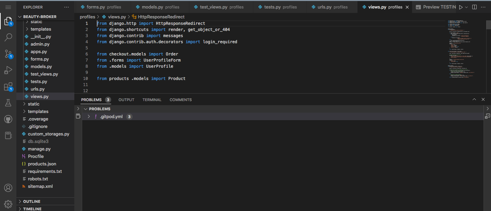
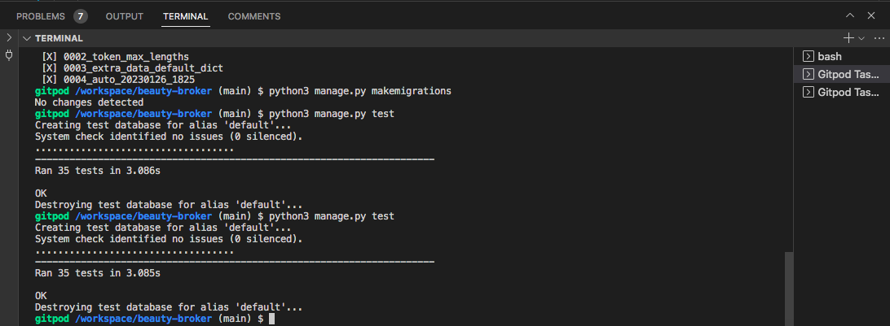

# Testing

- [Validators](#validators)
- [Manual Testing](#manual-testing)
- [Automated Testing](#automated-testing)
- [Fixed bugs](#fixed-bugs)

## Validators
#### W3C Html Validator
I ran all of the html templates used through the W3C html validator.

Homepage HTML Validation

 

Login HTML Validation

 

Menu HTML Validation

 

#### W3C CSS Jigsaw Validator
After running my style.css file through the CSS validator, there were no errors or warnings to show.

CSS Validator

 

#### Pep8 Python Validator
I used GitPod's built in Pep8 Python Validator to check my Python code for errors. After going back and adjusting a lot of lines so that they didn't exceed the acceptable line length, there are no Python errors to show.

As Gitpod shows errors in the problems window down by the terminal, I was able to eliminate syntax errors as I was writing my code.

Pep8 Python Validator

 

#### Lighthouse SEO
I ran different pages from Sushi & Sake's website through Chrome Dev Tool's Lighthouse validator, which gave high results in the 90s.

Homepage Lighthouse Validator

 

Contact Page Lighthouse Validator

 

Menu Lighthouse Validator

 

Booking Page Lighthouse Validator

 

### JSHint Javascript Validator 
The Sushi & Sake website only uses a small amount of Javascript. The snippet was taken from the Code Institute's CodeStar blog for flash messages. It passed the JS validation with no error other than a couple of undefined variables (set outside the scope of the snippet).

JSHint

 

### WEBAIM Contrast Checker
The main Sushi & Sake theme colours include dark grey and black background colours with white, red and yellow accents. I tested the main colours through the WEBAIM Contrast checker to ensure their accessibility.

Contrast check 1

Contrast check 2

 

## Manual Testing
### Responsiveness

Whilst testing the site, I mainly used a combination of a live server extension (port 800 on Gitpod), and Chrome DevTools to create a responsive site that maintains a consistent design down to a width of 320px. I was able to achieve this with minimal media queries due to taking a 'mobile first' design approach and utilising Bootstrap's fluid containers and column/rows.

To test responsiveness to different screen sizes, I manually tested with Chrome Developer Tools and [Responsive Design Checker](https://responsivedesignchecker.com/).

I also opened the site on the different screen sizes of my iPhone and iPad. This gave me the opportunity to see if the proportions felt natural on these screen sizes and also to test the compatability with Safari, as most of the development was with Chrome.

Further to this, I sent the deployed site to potential users with different devices (such as Android) and browsers for testing. There were no reported issues regarding layout or browse limitations.

### Browser Compatibility

I tested Beauty Broker's site on the following browsers with no visible issues for the user:
 - Google Chrome
 - Safari
 - Mozilla Firefox
 - Microsoft Edge

Appearance, functionality and responsiveness were consistent for users on various different screen sizes and browsers.

### Links and Filepaths
I manually tested all the of the links throughout the website, both those on the navigation bar and those on the pages themselves. All links worked on the deployed site when tested and redirected the user to the requested page. I also checked the same-page links on the admin panel.
When deployed to the live site, I also checked that there were no broken image links. As all the images were hosted in Cloudinary, this helped eliminated broken links due to incorrect filepaths, and all urls were correct and rendering the right image.

### Form Validation
During testing it became apparent that both the availability booking and contact forms were lacking in validation. Although the input type in the forms.py file put some input restrictions in place, (for example users are unable to type anything other than numbers into the contact number box for the contact form) some of the fields were allowing invalid inputs such as fields just containing blank spaces.
A large proportion of iteration 3 was spent considering which forms needed what evaluation and implementing this. Some of the hardest validations to test and implement were for the booking start and booking end times. I implemented validation that meant that users could not enter a date in the past, functions to restrict users to booking slots no more than two hours long. I found working with datetime objects to do this particularly challenging as I had to make sure that I wasn't comparing offset and naive datetime objects.
If an input does not meet the validation requirements, or a required field is empty, the form will flag this up to the user and explain the 

 

### Testing Feedback
- During the testing phase, my mentor fedback that I should improve the validation used on the forms throughout the site, and demonstrated that entering negative numbers into the product management page could in fact break the subsequent product pages. I took this on board and used a combination of changing CharFields to PositiveBigInteger fields in my models, along with min_value validators. The line_number field for the product model proved more tricky-- covered in the bugs section below.

- My mentor also picked up that I had initially forgotten to add a custom 404 page, which I then added.

- Along with the technical feedback received from my mentor, I sent the live site to family and friends to gain feedback from a user experience standpoint. This led to some design and content changes.
Initially, the mobile and medium screen size navbars did not include the Beauty Broker logo. As my friends and family were largely testing the site on various mobiles and iPads, it became clear that this was an oversight in mobile design as led to lack of brand presence. To rectify this, I added the logo to each size header, making use of media queries to make sure not to interrupt the navbar functionality.
This also led to me pushing the skincare secrets page into the scope of this sprint as it became clear some test users were, quote, "not really sure what they're looking at". Although those particular family members were perhaps not the target demographic of this project, it showed me that some education and context is very important when buying specialised product such as skincare.

## Automated Testing
In addition to testing through validators, and manual testing, I wrote numerous automated tests for the Beauty Broker project.

Tests covered the views.py files from different apps, ensuring that the correct template was being rendered, and that only the right level of authorised user could log in to certain pages.

I also tested models.py pages to ensure that the models were returning the correct strings, and forms.py files to ensure that the intended field were marked as required. I tested functions such as the calc_subtotal function from BagTools to ensure that the function was working as intended.

## Fixed Bugs
This was my first custom E-commerce project, which came with a steep learning curve! Having the debug=True setting for building and testing in Gitpod meant that most of the little errors and bugs could be solved along the way, but a few were definitely head-scratchers!

Heroku deployment- 'zoneports.info' error

 

Form Validation

 

Adding validation to the line number

Templating bug for id url

 

Caching issue

 

Street Address

 

Category templating

Brand Pages url

Accidental commit of database url

 