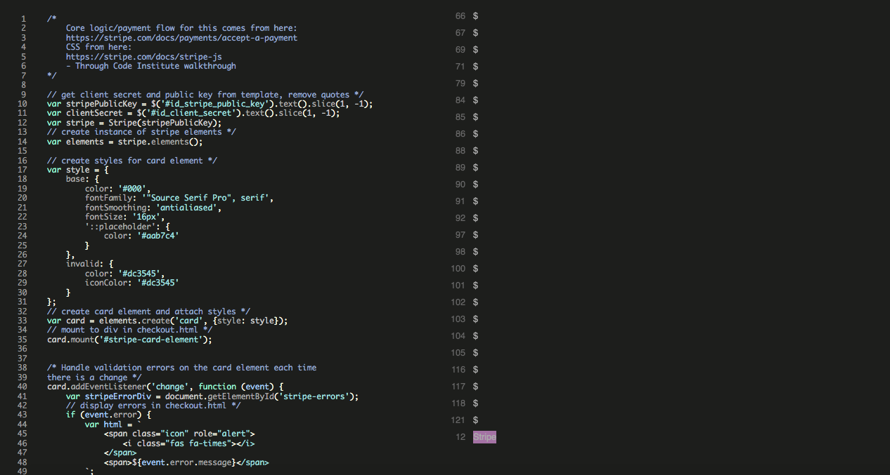

# Testing

- [Validators](#validators)
- [Manual Testing](#manual-testing)
- [Automated Testing](#automated-testing)
- [Fixed bugs](#fixed-bugs)

## Validators
#### W3C Html Validator
I ran all of the html templates used through the W3C html validator. To start with, there were a couple of unenclosed tags, and some aria-labelly attributes with no matching element. My biggest issue was to do with the header, the some of the li elements were the direct child of the nav element which is disallowed. After wrapping this in a ul tag, I then had to customise my css and bootstrap classes to make up for the change in layout.

After this, there were no errors to show, just one warning pertaining to the use of the type tag being unecessary on javascript resources.

HTML Validation

 

#### W3C CSS Jigsaw Validator

CSS Validator

All custom css passed with no errors. One warning relating to -webkit-transition being a vendor extension, which came from externally sourced code.

 

#### Pep8 Python Validator
I used GitPod's built in Pep8 Python Validator to check my Python code for errors. After going back and adjusting a lot of lines so that they didn't exceed the acceptable line length, there are no Python errors to show.

As Gitpod shows errors in the problems window down by the terminal, I was able to eliminate syntax errors as I was writing my code.

Pep8 Python Validator

 

#### Lighthouse SEO
I tested various pages of my sight in Chrome Dev Tools Lighthouse. Initially, the performance score was low as it took a long time to load the images. I went back to all the images, downloaded the smaller versions, compressed some and converted them into webp format, which greatly improved loading times.

Lighthouse Validator

 

### JSHint Javascript Validator 

JSHint

The bulk of the JS for this product is contained in the stripe_element.js file. The one warning for this was that Stripe was an undefined variable.

 

## Manual Testing
### Responsiveness

Whilst testing the site, I mainly used a combination of a live server extension (port 800 on Gitpod), and Chrome DevTools to create a responsive site that maintains a consistent design down to a width of 320px. I was able to achieve this with minimal media queries due to taking a 'mobile first' design approach and utilising Bootstrap's fluid containers and column/rows.

To test responsiveness to different screen sizes, I manually tested with Chrome Developer Tools and [Responsive Design Checker](https://responsivedesignchecker.com/).

I also opened the site on the different screen sizes of my iPhone and iPad. This gave me the opportunity to see if the proportions felt natural on these screen sizes and also to test the compatability with Safari, as most of the development was with Chrome.

Further to this, I sent the deployed site to potential users with different devices (such as Android) and browsers for testing. There were no reported issues regarding layout or browse limitations.

### Browser Compatibility

I tested Beauty Broker's site on the following browsers with no visible issues for the user:
 - Google Chrome
 - Safari
 - Mozilla Firefox
 - Microsoft Edge

Appearance, functionality and responsiveness were consistent for users on various different screen sizes and browsers.

### Links and Filepaths
I manually tested all the of the links throughout the website, both those on the navigation bar and those on the pages themselves. All links worked on the deployed site when tested and redirected the user to the requested page. Upon original deployment, some of the filepaths for the images were not working. As these were just for decorational purposes, I set these using CSS instead.

 

### Testing Feedback
- During the testing phase, my mentor fedback that I should improve the validation used on the forms throughout the site, and demonstrated that entering negative numbers into the product management page could in fact break the subsequent product pages. I took this on board and used a combination of changing CharFields to PositiveBigInteger fields in my models, along with min_value validators. The line_number field for the product model proved more tricky-- covered in the bugs section below.

- My mentor also picked up that I had initially forgotten to add a custom 404 page, which I then added.

- Along with the technical feedback received from my mentor, I sent the live site to family and friends to gain feedback from a user experience standpoint. This led to some design and content changes.
Initially, the mobile and medium screen size navbars did not include the Beauty Broker logo. As my friends and family were largely testing the site on various mobiles and iPads, it became clear that this was an oversight in mobile design as led to lack of brand presence. To rectify this, I added the logo to each size header, making use of media queries to make sure not to interrupt the navbar functionality.
This also led to me pushing the skincare secrets page into the scope of this sprint as it became clear some test users were, quote, "not really sure what they're looking at". Although those particular family members were perhaps not the target demographic of this project, it showed me that some education and context is very important when buying specialised product such as skincare.

## Automated Testing
In addition to testing through validators, and manual testing, I wrote numerous automated tests for the Beauty Broker project.

Tests covered the views.py files from different apps, ensuring that the correct template was being rendered, and that only the right level of authorised user could log in to certain pages.

I also tested models.py pages to ensure that the models were returning the correct strings, and forms.py files to ensure that the intended field were marked as required. I tested functions such as the calc_subtotal function from BagTools to ensure that the function was working as intended.

## Fixed Bugs
This was my first custom E-commerce project, which came with a steep learning curve! Having the debug=True setting for building and testing in Gitpod meant that most of the little errors and bugs could be solved along the way, but a few were definitely head-scratchers!

Heroku deployment- 'zoneports.info' error

 
When deploying project, I came across a 'zoneports.info' error, which kept causing the build to crash in Heroku. After some troubleshooting, I realised that I had started a new Gitpod workspace and that one of the packages I had installed was not the same version as the old workspace. I noticed that zoneports.info had not previously been in my requirements.txt file. I used pip list to check my installed packages and compare them to the packages in the previous workspace. Once all package versions matched I then removed zoneports.info from requirements.txt and Heroku deployed the app successfully.

Form Validation

 
When validating forms, I had a lot of trouble updating the line_number field on the product model. It was first set as a CharField but this left too much room for error, so I wanted to set it as a bigpositiveinteger field. However, as this is the primary key for this model, I was getting errors when trying to change the field type. I eventually got round this using validation in the forms.py file instead. I used a widget to change it to a Number Input, then added a min value validator with a minimum value of 0 to ensure that the number entered would always be positive.

Caching issue

 
After deploying my site, I decided to go back in and add some features based on user feedback. This included some new images and css. I ensured that I added the new image files to AWS, but on redeploying, I still couldn't see the new background images that had been set with css. This confused me initially as there were no broken file paths images either. After a bit of stalking through Slack and StackOverflow, I figured out that this was a caching issue. After clearing my browsing data, the images now show up.

Street Address

 
Small bug picked up from a user during user testing. I had accidentally templated the street address 1 to be confirmed back to the user twice, instead of street address 1, then street address 2. This was a quick fix.

Category templating

During the searching and sorting epic, I ran into some trouble with templating. When returning categories back through to the template, they were coming through as their name, and I was unable to access their friendly name. They were returning as a list containing their name. This was less of a problem for the product types, which are all one word, but it caused a bad user experience when it came to the skin type categories. For example, instead of 'Oily Skin' being returned to the template, ['oily_skin'] was showing.  
This was easier for product type as I just had to remove the brackets, which could be done via templating ( {{ product_type|join:"[]" }} ).
For skin type, I had to do this then replace the underscore with a space ( skin_concern_category = sc_word.replace('_', ' ')            sc_word = "".join(skin_type) ) to get the desired outcome.

Brand Pages url

Whilst creating my brand feature pages, I was trying to pass the url parameters in the same way I was using to access product detail pages (using id/pk variable). This was not working in this case, but the pages were displaying fine when the url was being typed in manually. I double checked through the view, the variable that was being returned and the templating syntax. I printed the variables to the terminal to ensure that the correct values were being passed through, but I was still getting the error for 'No Reverse Match'. As there were only two product pages, I just passed the ids in manually ( e.g. brand_page/1/) instead. Tutor support suggested that this might be due to the fact that the way I was trying to do it previously was for large amounts of items rather than just the two brands.

Accidental commit of database url

One mistake that will definitely cause me to be even more careful in future is the accidental commital of my new Elephant SQL database to my git commit history. Whilst changing over and migrating to the new database, I had commented out the line containing my new database url, causing me to overlook it upon my next commit. Luckily Git Guardian flagged it up and I was able to rectify my mistake (eventually). At first I tried using the gilt filter repo method and BFG cleaner, but could not remove the one line of code containing the database url. Sean from tutor support helped me to undo my last few commits (there was not much code, I was just changing small settings to prepare for deployment) and then commit and push my code back to GitHub, the same as it was but without the database url in the history.

 